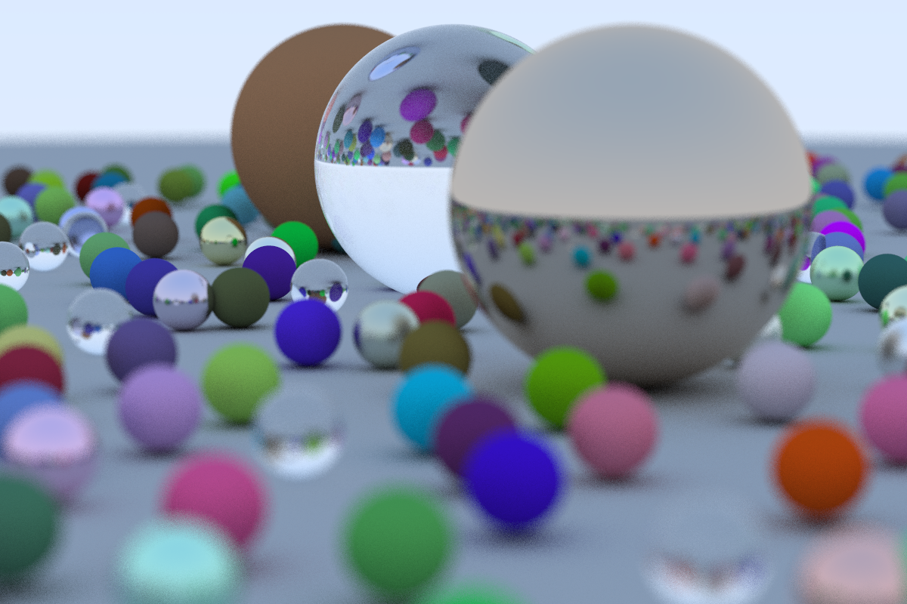

# ray-tracing
ray-tracing in one weekend

#  What this one doing?

This is the first in a sequal of three - C++ repo for ray tracing. In this repo, a C++ repo for ray-tracing is port into Rust.

# How to use it?

Install ray-tracing

```cargo install --path .```

Run ray-tracing.

```ray-tracing```

This API for running can be improve in future work by introduce additonal option for image size etc.
The output is in ppm and you can convert it into png using ```imagemagick```.

```brew install imagemagick```

Then convert it into png:

```convert output.ppm output.png```

The final image will look something like this:




